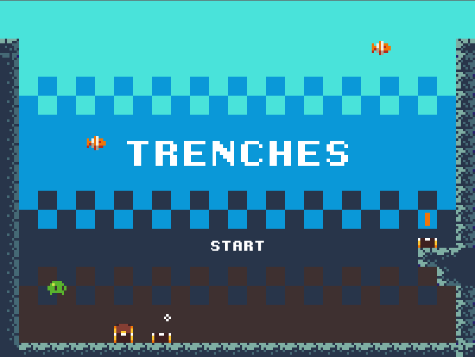

# Trenches

Treasures from the deep

Get all the treasures from the deep of the ocean. But be careful how long you stay underwater.

Move with arrow keys.

Trenches was developed for the [Mini jam 3rd Edition](https://itch.io/jam/mini-jam3rdedition). The themes were SALVAGE and DARKNESS. Art was restricted to a [provided tilemap and spritesheet](https://mini-jam.itch.io/mini-jam-3rd-edition-tile-set).

Game was made by me using Construct 2. Art by [King.exe](https://kingexe.itch.io/). Music by [Eric Skiff](https://ericskiff.com/).

